# VoyageHub - UML Flowchart & System Architecture

## Overview
VoyageHub adalah sistem manajemen perjalanan dinas berbasis Laravel yang memiliki dua peran utama: User (Karyawan) dan Admin. Sistem ini mengelola siklus lengkap perjalanan dinas mulai dari pengajuan hingga pelaporan.

## 1. Class Diagram

```mermaid
classDiagram
    class User {
        +int id
        +string nik
        +string name
        +string email
        +string password
        +enum role [user, admin]
        +timestamp email_verified_at
        +timestamp created_at
        +timestamp updated_at
        +journeys()
        +travelRequests()
        +findForPassport(username)
        +validateCredentials(user, credentials)
    }

    class TravelRequest {
        +int id
        +int user_id
        +string purpose
        +string destination
        +date start_date
        +date end_date
        +decimal budget
        +enum status [pending, approved, rejected]
        +text notes
        +int approved_by
        +timestamp approved_at
        +timestamp created_at
        +timestamp updated_at
        +user()
        +approver()
        +journey()
    }

    class Journey {
        +int id
        +int user_id
        +int travel_request_id
        +string title
        +string destination
        +datetime start_date
        +datetime end_date
        +string transport
        +string accommodation
        +decimal budget
        +text notes
        +timestamp created_at
        +timestamp updated_at
        +user()
        +travelRequest()
    }

    class AppConfiguration {
        +int id
        +int organization_id
        +string key
        +text value
        +string type [string, number, boolean, json]
        +timestamp created_at
        +timestamp updated_at
        +getValue(key, organizationId)
        +setValue(key, value, organizationId)
    }

    class ReportTemplate {
        +int id
        +int organization_id
        +string name
        +enum type [excel, pdf]
        +string template_path
        +boolean is_default
        +timestamp created_at
        +timestamp updated_at
        +getDefault(organizationId, type)
        +getByType(type, organizationId)
    }

    %% Relationships
    User ||--o{ TravelRequest : "has many"
    User ||--o{ Journey : "has many"
    User ||--o{ TravelRequest : "approves"
    TravelRequest ||--o| Journey : "becomes"
    TravelRequest }o--|| User : "belongs to"
    Journey }o--|| User : "belongs to"
    Journey }o--|| TravelRequest : "belongs to"
```

## 2. Use Case Diagram

```mermaid
flowchart TD
    %% Actors
    User[👤 User/Employee]
    Admin[👨‍💼 Admin]
    System[🔧 System]

    %% User Use Cases
    User --> UC1[📝 Create Travel Request]
    User --> UC2[👁️ View My Requests]
    User --> UC3[✏️ Edit Pending Request]
    User --> UC4[🗑️ Delete Pending Request]
    User --> UC5[🧳 Create Journey]
    User --> UC6[👁️ View My Journeys]
    User --> UC7[✏️ Edit Journey]
    User --> UC8[🔔 View Notifications]
    User --> UC9[👤 Manage Profile]

    %% Admin Use Cases
    Admin --> UC10[📋 Dashboard Analytics]
    Admin --> UC11[✅ Approve/Reject Requests]
    Admin --> UC12[👥 User Management]
    Admin --> UC13[🧳 Journey Management]
    Admin --> UC14[📊 Reports & Analytics]
    Admin --> UC15[📤 Export Data]
    Admin --> UC16[⚙️ App Configuration]
    Admin --> UC17[📋 Report Templates]

    %% System Use Cases
    System --> UC18[📧 Send Notifications]
    System --> UC19[📈 Generate Charts]
    System --> UC20[📄 PDF Generation]
    System --> UC21[📊 Excel Export]

    %% Include/Extend Relationships
    UC1 -.->|includes| UC18
    UC11 -.->|includes| UC18
    UC14 -.->|extends| UC20
    UC14 -.->|extends| UC21
    UC15 -.->|includes| UC20
    UC15 -.->|includes| UC21
```



## 3. System Flow Diagram

```mermaid
flowchart TD
    Start([🚀 Start]) --> Login{🔐 Login}

    Login -->|User| UserDash[📱 User Dashboard]
    Login -->|Admin| AdminDash[🏢 Admin Dashboard]

    %% User Flow
    UserDash --> CreateReq[📝 Create Travel Request]
    UserDash --> ViewReq[👁️ View My Requests]
    UserDash --> CreateJourney[🧳 Create Journey]
    UserDash --> ViewJourney[👁️ View My Journeys]

    CreateReq --> ReqSubmit{📤 Submit Request}
    ReqSubmit --> NotifyAdmin[📧 Notify Admin]
    NotifyAdmin --> PendingStatus[⏳ Status: Pending]

    %% Admin Flow
    AdminDash --> ReviewReq[📋 Review Requests]
    AdminDash --> ManageUsers[👥 Manage Users]
    AdminDash --> ManageJourneys[🧳 Manage Journeys]
    AdminDash --> Reports[📊 Reports & Analytics]

    ReviewReq --> ApproveReject{✅❌ Approve/Reject}
    ApproveReject -->|Approve| Approved[✅ Status: Approved]
    ApproveReject -->|Reject| Rejected[❌ Status: Rejected]

    Approved --> NotifyUser[📧 Notify User]
    Rejected --> NotifyUser

    NotifyUser --> CreateJourney

    %% Journey Flow
    CreateJourney --> JourneyForm[📋 Journey Form]
    JourneyForm --> SaveJourney[💾 Save Journey]
    SaveJourney --> JourneyComplete[✅ Journey Created]

    %% Reports Flow
    Reports --> QuickExport[📤 Quick Export]
    Reports --> AdvancedReports[📈 Advanced Reports]
    Reports --> ReportTemplates[📋 Report Templates]

    QuickExport --> ExportFormat{📄 Format?}
    ExportFormat -->|Excel| ExcelFile[📊 Excel File]
    ExportFormat -->|PDF| PDFFile[📄 PDF File]

    AdvancedReports --> ReportType{📈 Report Type?}
    ReportType -->|Summary| SummaryReport[📋 Summary Report]
    ReportType -->|Detailed| DetailedReport[📄 Detailed Report]
    ReportType -->|Budget| BudgetReport[💰 Budget Analysis]

    ReportTemplates --> SelectTemplate[📋 Select Template]
    SelectTemplate --> TemplateFilters[🔍 Apply Filters]
    TemplateFilters --> GenerateFromTemplate[📄 Generate Report]

    %% End States
    JourneyComplete --> End([🏁 End])
    ExcelFile --> End
    PDFFile --> End
    SummaryReport --> End
    DetailedReport --> End
    BudgetReport --> End
    GenerateFromTemplate --> End
```



## 4. Database ERD (Entity Relationship Diagram)


## 5. Component Architecture

```mermaid
flowchart TB
    subgraph "🌐 Frontend Layer"
        Views[📱 Blade Views]
        Assets[🎨 CSS/JS Assets]
        Components[🧩 UI Components]
    end

    subgraph "🎮 Controller Layer"
        AuthCtrl[🔐 AuthController]
        UserCtrl[👤 UserController]
        JourneyCtrl[🧳 JourneyController]
        RequestCtrl[📝 TravelRequestController]
        AdminCtrl[👨‍💼 Admin Controllers]
        ReportCtrl[📊 ReportController]
    end

    subgraph "🏗️ Service Layer"
        AuthService[🔐 Authentication]
        NotificationService[📧 Notifications]
        ExportService[📤 Export Service]
        ReportService[📊 Report Generation]
    end

    subgraph "📊 Model Layer"
        UserModel[👤 User]
        JourneyModel[🧳 Journey]
        RequestModel[📝 TravelRequest]
        ConfigModel[⚙️ AppConfiguration]
        TemplateModel[📋 ReportTemplate]
    end

    subgraph "🗄️ Database Layer"
        MySQL[(🗄️ MySQL Database)]
        Migrations[📋 Migrations]
        Seeders[🌱 Seeders]
    end

    subgraph "🔧 External Services"
        DomPDF[📄 DomPDF]
        Excel[📊 Maatwebsite Excel]
        Mail[📧 Mail Service]
    end

    %% Connections
    Views --> AuthCtrl
    Views --> UserCtrl
    Views --> JourneyCtrl
    Views --> RequestCtrl
    Views --> AdminCtrl
    Views --> ReportCtrl

    AuthCtrl --> AuthService
    ReportCtrl --> ReportService
    ReportCtrl --> ExportService

    AuthService --> UserModel
    ReportService --> JourneyModel
    ReportService --> RequestModel
    ExportService --> DomPDF
    ExportService --> Excel

    UserModel --> MySQL
    JourneyModel --> MySQL
    RequestModel --> MySQL
    ConfigModel --> MySQL
    TemplateModel --> MySQL

    NotificationService --> Mail
```



## 6. Authentication & Authorization Flow


## 7. Travel Request Workflow


## 8. Report Generation Flow


## 9. Key Features Summary

### 🔐 Authentication & Authorization
- NIK-based login system
- Role-based access control (User/Admin)
- Session management
- Protected routes with middleware

### 👤 User Management
- User registration and profile management
- Role assignment and permissions
- User activity tracking

### 📝 Travel Request Management
- Request creation and submission
- Approval workflow
- Status tracking
- Notification system

### 🧳 Journey Management
- Journey planning and creation
- Budget tracking
- Travel documentation
- Journey history

### 📊 Reports & Analytics
- Quick export (Excel/PDF)
- Advanced reports (Summary, Detailed, Budget Analysis)
- Report templates
- Interactive dashboards
- Chart generation

### ⚙️ Configuration Management
- Application settings
- Organization-specific configurations
- Template management

## 10. Technology Stack

- **Backend**: Laravel 10.x (PHP)
- **Frontend**: Blade Templates, Bootstrap 5, JavaScript
- **Database**: MySQL
- **Authentication**: Laravel Auth
- **PDF Generation**: DomPDF
- **Excel Export**: Maatwebsite/Excel
- **Charts**: Chart.js
- **Notifications**: Laravel Notifications
- **Middleware**: Custom admin authorization

---

## Deployment & Infrastructure

```mermaid
flowchart TB
    subgraph "🌐 Production Environment"
        WebServer[🌐 Web Server<br/>Apache/Nginx]
        PHP[🐘 PHP 8.1+]
        MySQL[🗄️ MySQL 8.0+]
    end

    subgraph "📁 Application Structure"
        Laravel[🎯 Laravel App]
        Storage[📁 Storage<br/>Uploads & Cache]
        Logs[📝 Log Files]
    end

    subgraph "🔧 External Dependencies"
        Composer[📦 Composer]
        NPM[📦 NPM/Yarn]
        Mail[📧 Mail Service]
    end

    WebServer --> Laravel
    PHP --> Laravel
    Laravel --> MySQL
    Laravel --> Storage
    Laravel --> Logs
    Laravel --> Mail
```



Flowchart UML ini memberikan gambaran komprehensif tentang arsitektur sistem VoyageHub, termasuk model data, alur proses, komponen sistem, dan hubungan antar entitas.